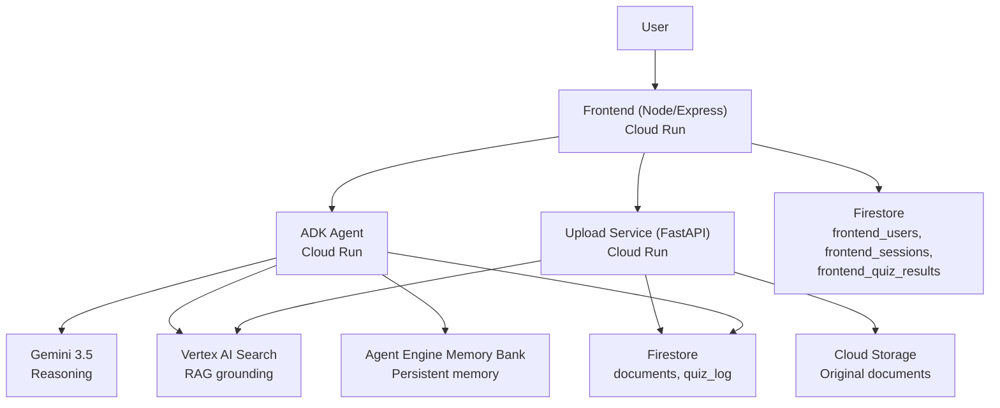

# Literay

An AI reading partner for dense documents (contracts, leases, ToS) — walks
you through them clause by clause, grounds every explanation in the real
source text (RAG), and remembers which topics you've struggled with across
sessions so it explains them more carefully next time.

Built for Google's **"All Things Agentic" hackathon** — Collaborative
Partner track.

## Live deployment

| Service | URL |
|---|---|
| **App (start here)** | `https://literay-frontend-799447425682.asia-southeast1.run.app` |
| Backend agent (ADK) | `https://adk-default-service-name-799447425682.asia-southeast1.run.app` |
| Upload/document service | `https://literay-upload-service-799447425682.asia-southeast1.run.app` |

## Architecture



Three independently deployed Cloud Run services:
- **`literay_frontend`** (Node/Express) — the web app: Google login, chat UI, upload UI, quiz panel, progress view. Talks to the other two services over HTTP.
- **`literay_backend/literay_agent`** (Python, ADK) — the conversational agent. Calls Gemini, grounds answers via Vertex AI Search, reads/writes persistent memory via Agent Engine Memory Bank.
- **`literay_backend/literay_agent` → `upload_server.py`** (Python, FastAPI) — handles document upload/delete/status: writes to Cloud Storage + Vertex AI Search + Firestore.

## Repo layout

```
literay_backend/    # both Python services — see literay_backend/README.md
literay_frontend/   # the Node/Express web app — see literay_frontend/README.md
```

Each subfolder's own README has full spin-up instructions (local dev + Cloud Run deploy).
Start with `literay_backend/README.md` — the two backend services need to be
running before the frontend can do anything useful.

## Tech stack

Gemini 3.5, Google ADK, Vertex AI Search, Agent Engine Memory Bank,
Firestore, Cloud Storage, Cloud Run, Google Identity Services (OAuth),
Node.js/Express, vanilla JS + marked.js/DOMPurify.
